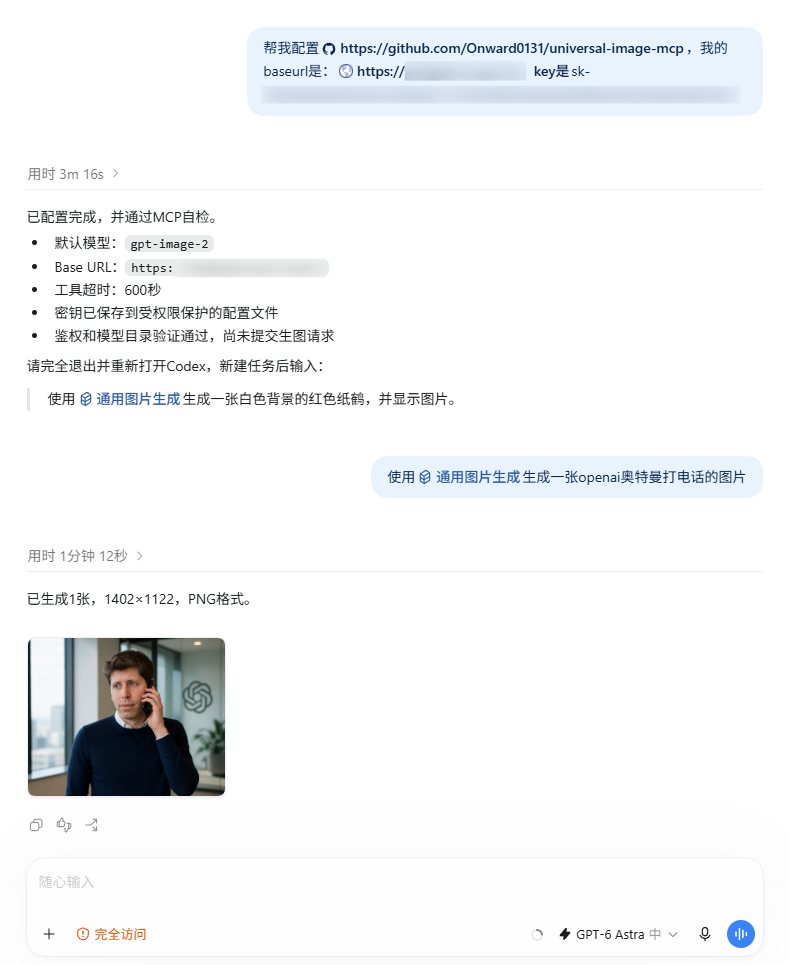

# Universal Image MCP for Codex

English | [简体中文](README.md)

Generate, edit, save, and display images in Codex through a provider you configure. The local stdio MCP handles image bytes and returns text JSON, absolute paths, and Markdown. The main model API does not need to accept MCP image content blocks.

Package and executable: `universal-image-mcp`. MCP registration and Skill: `universal-image`. No third-party endpoint or image model is selected by default.

## Beginner walkthrough

> **Check that your key belongs to an image-generation group.** Many third-party API providers require a separate key created under a dedicated group, often called `image`, “生图”, or “额外生图”. A key for chat, coding, or other model groups may not support image generation. Check the provider's dashboard to confirm that the group allows your chosen image model, then use its key. Group names and permission rules depend on the provider.

Follow [Windows installation](#windows-installation), or share this repository with Codex and ask it to help with the installation steps. Once configured, restart Codex, start a new task, and describe the image you want. This Chinese-language screenshot shows setup, the MCP check, and a generated image displayed in the conversation:



The Base URL and key are obscured in the screenshot. Enter your key through the installer's masked prompt. The model and resulting image dimensions depend on your configured provider.

## Supported protocols

|Protocol|Typical service|Generation|Reference editing|
|---|---|---|---|
|OpenAI Images|OpenAI and compatible gateways|JSON|Single-image multipart|
|Gemini generateContent|Gemini and compatible gateways|Text parts|inlineData|
|OpenAI Chat image output|OpenRouter and compatible gateways|Messages|image_url|

Configure Base URL, model, authentication, headers, endpoints, query parameters, and extra JSON. Protocol support does not mean every provider and model has been tested. Dedicated asynchronous APIs, ComfyUI workflows, OAuth, masks, and multiple reference images need additional adapters.

- [Provider configuration](docs/PROVIDERS.md)
- [Complete capability and degradation matrix](CAPABILITIES.en.md)
- [Authorized live test record](docs/LIVE-TEST.md)
- [Engineering assessment](docs/ASSESSMENT.md)

## Windows installation

Use Windows 10/11 with a working `codex` command. No preinstalled Node.js, npm, PowerShell 7, or administrator access is required. The installer prefers PowerShell 7 and supports the Windows PowerShell 5.1 fallback.

1. Download `Universal-Image-MCP-v2.0.0.zip` from [Releases](https://github.com/Onward0131/universal-image-mcp/releases/latest) and extract it.
2. Double-click `install.cmd`, select a provider, and enter its complete API prefix, model ID, and a key with image-generation access. If the provider requires a dedicated group, use a key from its `image` or image-generation group.
3. Wait for installation to finish, fully restart Codex, and start a new task.

A Base URL includes any required version prefix, such as `https://your-provider.example/v1`; the server never adds `/v1` automatically. Official provider presets supply their own endpoints. Configure an image model available to your account.

From PowerShell 7:

```powershell
.\install.ps1 -Provider openai-compatible -BaseUrl "https://your-provider.example/v1" -Model "your-image-model"
```

The key prompt masks input. Import advanced JSON with `-ProviderConfigPath`. Environment references forward names through Codex `env_vars` without copying values into its configuration. A trusted keyless local gateway can use `auth_type: "none"`.

The installer verifies a pinned official Node.js 24.19.0 runtime, installs bundled dependencies offline, restricts state-directory permissions, installs the Skill, and sets and verifies the MCP tool timeout at 600 seconds. It uses `D:\CodexTools\universal-image-mcp`, or `%LOCALAPPDATA%\CodexTools\universal-image-mcp` when D: is unavailable. It does not modify system PATH.

## Use in Codex

```text
Use $universal-image to generate a red paper crane on a white studio background, centered, with a soft shadow and no text. Display the saved image in this conversation.
```

For editing, provide an absolute reference path and the requested change. References are currently one PNG/JPEG/WebP file up to 10 MB.

|Tool|Purpose|Billable|
|---|---|---|
|`image_doctor`|Check configuration and optionally the model directory|No|
|`list_image_models`|Read model IDs|No|
|`explain_image_capability`|Explain selection and uncertainty|No|
|`generate_image`|Generate and save files|Yes|
|`edit_image`|Edit a reference and save files|Yes|
|`inspect_image`|Inspect local dimensions, format, and hash|No|

Doctor reports `generation_channel_status=not_probed` because it does not generate images. An unverified directory is non-blocking when an explicit model is available and authentication has not been rejected.

`model=auto` uses the configured model or one unambiguous image candidate. Explicit model IDs remain intact even if absent from an incomplete catalog. Unspecified optional Images parameters are omitted. Gemini and chat adapters accept `count=1` with automatic size/format; provider-specific controls belong in trusted configuration.

Generation and editing are submitted once. There are no automatic billable retries or model/provider fallbacks. Actual files are inspected; size, format, and count mismatches are reported as `degraded` without discarding the output.

## Upgrading

Version 2.0.0 changes the package, executable, installation path, state path, MCP registration, and Skill names. Version 1.x environment aliases, implicit endpoints, provider-specific model preferences, and historical capability snapshots are removed.

For a v1.x migration, preserve the configuration you need, uninstall the old instance using its original installer, then install v2.0.0 with an explicit provider configuration. Previous tags and releases remain historical records. Within v2.x, rerunning the installer preserves complete configuration; changing the connection clears old authentication and routing. `-Model` changes the model and `-ResetApiKey` replaces credentials.

```powershell
.\install.ps1 -Uninstall
```

Only the verified installation, MCP entry, and Skill link are removed. Generated images remain.

## Source setup and verification

Use Node.js 22 or newer and follow [manual MCP configuration](docs/PROVIDERS.md#codex源码接入与多供应商). Node runtime code works across platforms; automated installation targets Windows. Separate MCP registrations can use separate config files and keys.

```powershell
npm ci
npm test
npm audit --omit=dev --audit-level=moderate
.\scripts\build-release.ps1
```

Offline tests do not call image providers. `scripts/live-mcp-smoke.mjs` is billable and requires the key owner's authorization. Never commit credentials, raw provider responses, or private images.

`MCP error -32001: Request timed out` is a host timeout; verify the 600-second setting and restart Codex. Do not replay an uncertain request. Inspect `data.result.deviations` for output mismatches. Private image-download URLs remain blocked; local gateways may return Base64 instead.

If a key works for chat but not images, check its group and the image models that group permits. If required, create a key under the provider's dedicated image-generation group and update the configuration with `-ResetApiKey`. Changing the model name alone does not grant additional key permissions.

An independent community integration under the [MIT License](LICENSE), not an official project of Codex or an API provider.
